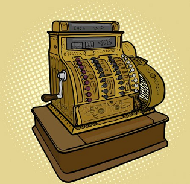
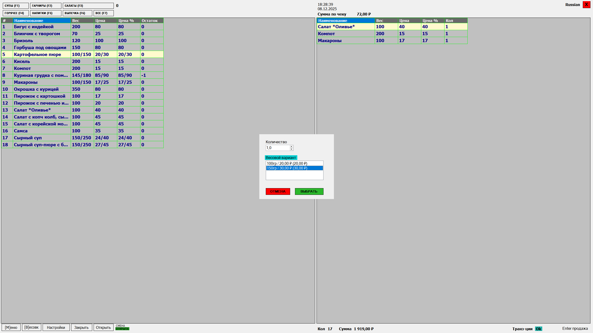
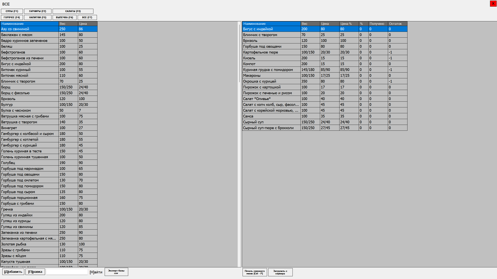
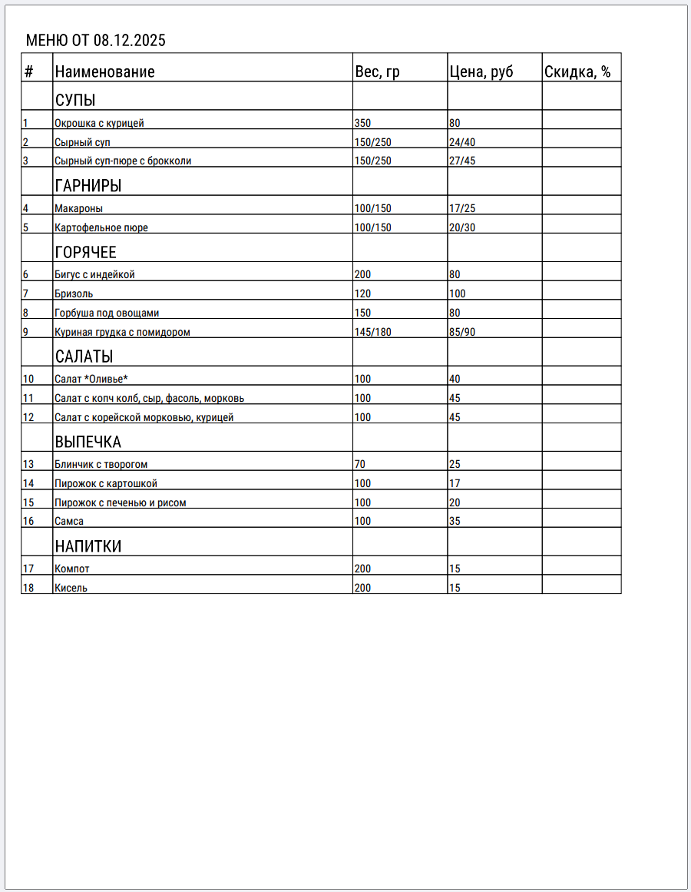

  

# LittleSeller

**LittleSeller** is a laptop POS application for a mobile / field kitchen.  
It helps manage a dishes database, build a daily (shift) menu, print the menu, open/close shifts, and process receipts with delivery to a fiscal device and to a remote sales statistics server.

---

## Features

- Editable dishes database (add / update items).
- Build a **daily (shift) menu** by selecting dishes from the database.
- Generate and print the daily menu with categories (soups, sides, drinks, etc.).
- Open / close a shift.
- Open / close a receipt.
- Send receipts to an integrated fiscal device.
- Send receipts to a remote sales statistics server.
- **Reliable receipt delivery** to the server:
  - works under poor/unstable internet,
  - asynchronous sending in a background thread,
  - prevents duplicate receipts on the server.

---

## Screenshots

**Main screen**

**Dishes Catalog & Menu Builder screen**

**Daily Menu Print Preview**

---

## Tech Stack

### Desktop (WinForms)

- WinForms  
- Entity Framework  
- SQLite  
- `async/await`  
- `lock`  
- Architecture: **MVP (Model–View–Presenter)**

### Server

- PHP (custom engine)  
- MySQL

---

## Architecture (high level)

- UI follows the **MVP** pattern: most logic lives in Presenters, the UI stays “thin”.
- Receipt sending is **asynchronous** and does not block the cashier workflow under poor internet.
- Reliability is achieved via a guaranteed delivery approach and anti-duplication logic (conceptually: idempotency / unique receipt checks on the server side).

---

## Repository Structure

- `/Desktop` — WinForms POS application  
- `/Server` — PHP sales statistics server  

---

## Running (Desktop)

### Requirements

- Windows
- .NET Framework
- Visual Studio (optional)

### Important: SQLite database

This project uses a **pre-created SQLite file** that was created manually (there are no EF migrations).  
To run the app, you need a database file with the correct schema.

**Steps:**
1. Take the database file: `Desktop\LettleSeller\kassa.db`.
2. Put it into: `Desktop\LettleSeller\bin\db\`.

---

## Running (Server, PHP) — status

The repository contains the `/Server` folder with the PHP part (sales statistics server).

⚠️ At the moment, the server side is **not fully reproducible from this repository**, because:
- the MySQL tables were created manually via phpMyAdmin (no migrations / no SQL dump),
- deployment was done manually (e.g., uploading files to hosting via FTP),
- the full setup steps and database schema are not captured as scripts.

### What it means

- `/Server` can be used as a **reference** (implementation and logic),
- but it may be difficult to deploy it from scratch without additional documentation / a DB dump.

### Roadmap

- [ ] Add an SQL dump (`schema.sql`) or a table-creation script  
- [ ] Document environment/config setup  
- [ ] Package the server with Docker for easy local run  

---

## Author

- GitHub: [aleshin-roman-nk](https://github.com/aleshin-roman-nk)
- LinkedIn: [Roman Aleshin](https://www.linkedin.com/in/roman-aleshin)
